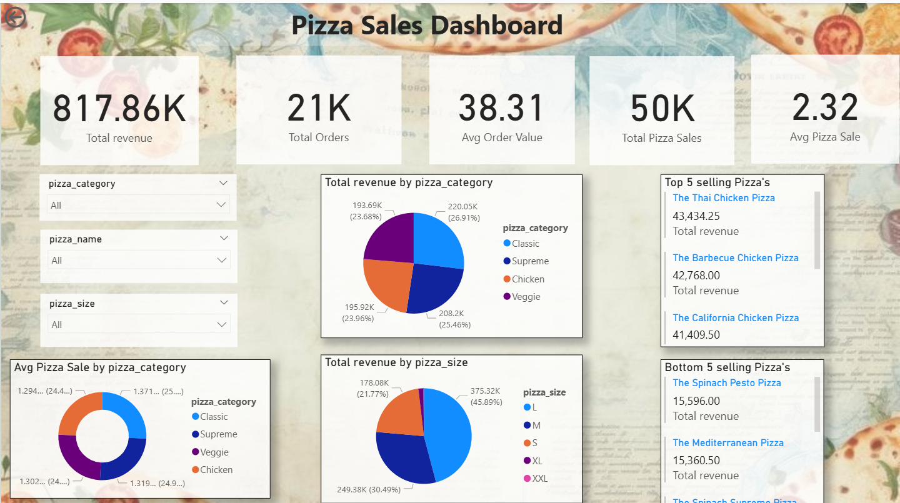

# 🍕 Pizza Sales Dashboard

An interactive dashboard built using **Power BI** to analyze and visualize pizza sales data.

## 📊 Features
- Total revenue and profit analysis
- Best-selling pizzas and categories
- Time-based sales trends (monthly, weekly)
- Dynamic filters (category, date range, etc.)

## 🛠️ Tools Used
- Power BI
- Excel (data source)
- DAX (for calculated measures)

## 📷 Screenshots

## 📁 Project Files
- `PizzaSalesDashboard.pbix` - Main Power BI file
- `pizza_sales_data.xlsx` - Sample dataset

## 🚀 How to Use
1. Download the `.pbix` file
2. Open in Power BI Desktop
3. Explore filters and visuals

## 📬 Contact
Created by Gajanan Shinde(https://github.com/Gajanan2004)  
Feel free to reach out via  www.linkedin.com/in/gajanan-shinde-354136314

